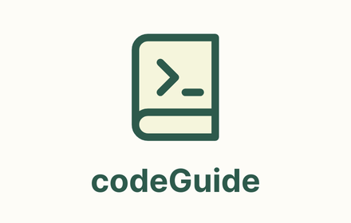

# 🚀 CodeGuide - AI-Powered Code Explainer

## 📌 About
CodeGuide is a **Chrome extension** that provides **AI-generated explanations** for code snippets found on web pages. It integrates with **FastAPI** and **LangChain** to process and explain code using Large Language Models (LLMs).




## 🛠️ Installation Guide

### **1️⃣ Setting Up the Chrome Extension**
1. Clone the repository:
   ```bash
   git clone https://github.com/dineshram0212/codeguide.git
   cd codeguide/extension
   ```
2. Open **Chrome** and navigate to:
   ```
   chrome://extensions/
   ```
3. Enable **Developer Mode** (top-right corner).
4. Click **"Load Unpacked"** and select the `extension/` folder.
5. Your extension is now installed!

---

### **2️⃣ Running the Backend**
You have **two options** for running the backend:

### **Option 1: Run the Executable (Easiest)**
If you don't want to set up Python, you can simply run the **provided EXE file**:

1. Download the `codeguide_backend.exe` file from **Releases**.
2. **Double-click to run it**. The backend will start automatically.
3. The API will be available at:
   ```
   http://localhost:8000
   ```

### **Option 2: Run the Backend Manually (For Developers)**
If you prefer setting up the backend yourself:

1. Navigate to the backend folder:
   ```bash
   cd ../backend
   ```
2. Install dependencies:
   ```bash
   pip install -r requirements.txt
   ```
3. Run the server:
   ```bash
   uvicorn main:app --host 0.0.0.0 --port 8000
   ```
4. The backend is now running at:
   ```
   http://localhost:8000
   ```

---

## 🔄 **Switching Between Local and Deployed API**
- By default, the extension **calls a hosted API** (if deployed).  
- If you're running the backend **locally**, you need to update the extension's API endpoint:
  1. Open **`popup.js`** and **`content.js`** inside `extension/`.
  2. Find API calls (e.g., `fetch("https://your-api-url.com/explain")`).
  3. Change it to:
     ```javascript
     fetch("http://localhost:8000/explain")
     ```
  4. Save the files and **reload the extension** in `chrome://extensions/`.

---

## 🚀 Deployment Guide (For Hosting on Render)
If you want to make the backend **publicly accessible**, you can **deploy it on Render**.

1. **Push your backend to GitHub**
2. **Go to [Render](https://render.com) → New Web Service**
3. **Connect your GitHub repo**
4. **Set the Start Command:**
   ```bash
   uvicorn main:app --host 0.0.0.0 --port $PORT
   ```
5. **Deploy & get a public API URL**, then update your Chrome extension to use this URL.

---

## 🔑 API Key Configuration
To use LLMs like **OpenAI**, **Groq**, or **Anthropic**, you need an API key.

1. Open the Chrome extension popup
2. Enter your **API key**
3. Select the **AI model**
4. Save settings

---

## 📜 License
This project is licensed under the **MIT License**.

---

## 📧 Contact
- **GitHub:** [dineshram0212](https://github.com/dineshram0212)
- **Email:** [your-email@example.com]
- **Website:** [your-website.com]

---

**🚀 Try CodeGuide today and get AI-powered code explanations instantly!**
```

---

### **🔹 Key Updates in This Version**
✅ **Mentioned that users can run the EXE file instead of setting up Python manually**.  
✅ **Kept the local vs. hosted API instructions**.  
✅ **Still clean and direct, no unnecessary sections**.  

Now users **don’t need Python** if they use the EXE file! 🚀 Let me know if you need **further refinements**.